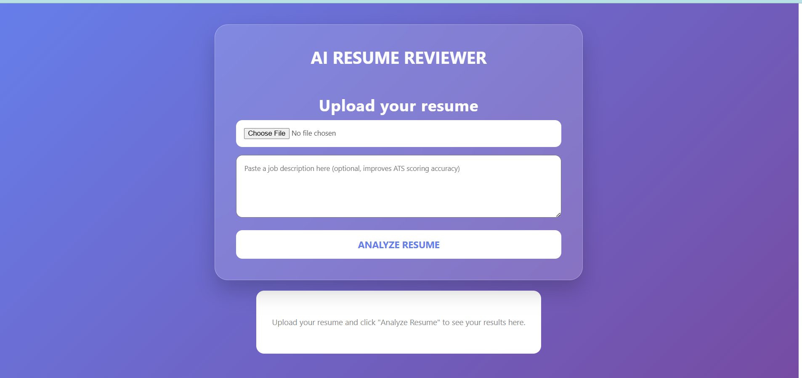
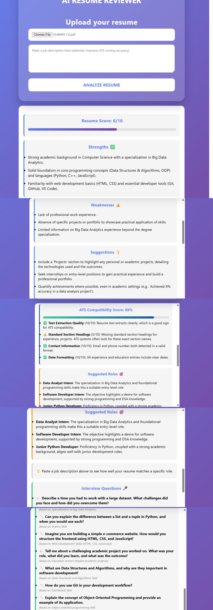
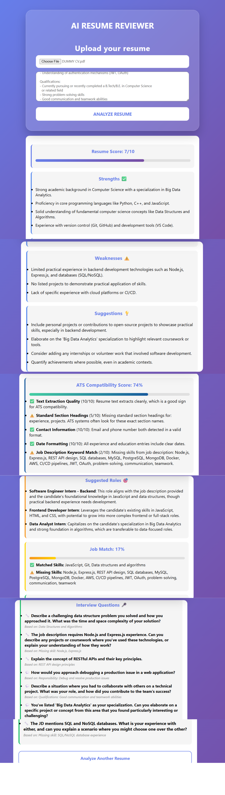

# AI Resume Reviewer

An AI-powered resume analysis tool that helps job seekers optimize their resumes for ATS systems, match against job descriptions, and prepare for interviews.

🔗 **Live Demo**: https://playful-sopapillas-028f39.netlify.app

---

## Features

- **Resume Score**: Overall quality score with strengths, weaknesses, and actionable suggestions
- **ATS Compatibility Score**: Rule-based checks for text extraction quality, standard section headings, contact information, date formatting, and job description keyword overlap
- **Job Match Analysis**: Paste any job description to see matched and missing skills with a match percentage
- **Suggested Roles**: AI-suggested job titles that fit your current skill set
- **Interview Question Generator**: Targeted technical and behavioral questions based on your resume and job description gaps

---

## Tech Stack

**Frontend**
- HTML, CSS, JavaScript (Vanilla)
- Deployed on Netlify

**Backend**
- Node.js, Express.js
- Multer (PDF upload handling)
- pdf-parse (PDF text extraction)
- Google Gemini API (gemini-2.5-flash-lite)
- Deployed on Render

---

## Architecture

The backend follows a single-call pipeline design:

1. PDF is uploaded and parsed to raw text using `pdf-parse`
2. A single Gemini API call extracts structured resume data (skills, experience, education, projects, contact), scores the resume, and extracts job description skills simultaneously
3. Four rule-based ATS checks run locally on the extracted data (no extra API calls)
4. All results (score, ATS breakdown, job match, suggested roles, interview questions) are returned in one response

This design minimizes API calls (one per upload regardless of features used), reduces latency, and stays within free-tier quota limits.

---

## Running Locally

**Prerequisites**: Node.js, a Gemini API key from https://aistudio.google.com

**Backend**
```bash
cd backend
npm install
```

Create a `.env` file in the `backend` folder:
GEMINI_API_KEY=your_key_here

FRONTEND_ORIGIN=http://127.0.0.1:5500

PORT=3000
Start the server:
```bash
node server.js
```

**Frontend**

Open `frontend/index.html` with Live Server in VS Code, or any local static file server pointed at the `frontend` folder.

---

## ATS Scoring Breakdown

The ATS score is computed from up to 5 independent checks, each scored 0-10:

| Check | What it measures |
|---|---|
| Text Extraction Quality | Whether the PDF can be cleanly parsed (proxy for real ATS parseability) |
| Standard Section Headings | Presence of Experience, Education, Skills, Projects headings |
| Contact Information | Valid email and phone number detected |
| Date Formatting | Consistent year-based dates across experience and education entries |
| JD Keyword Match | Skill overlap between resume and pasted job description (optional) |

---

## Screenshots
### Upload Interface

### Resume Analysis (Without Job Description)

### Resume Analysis (With Job Description)


---

## Future Improvements

- Semantic skill matching using embeddings (currently keyword-based)
- Real job listing integration via Adzuna API
- Support for DOCX resume uploads
- User accounts to save and track resume versions over time